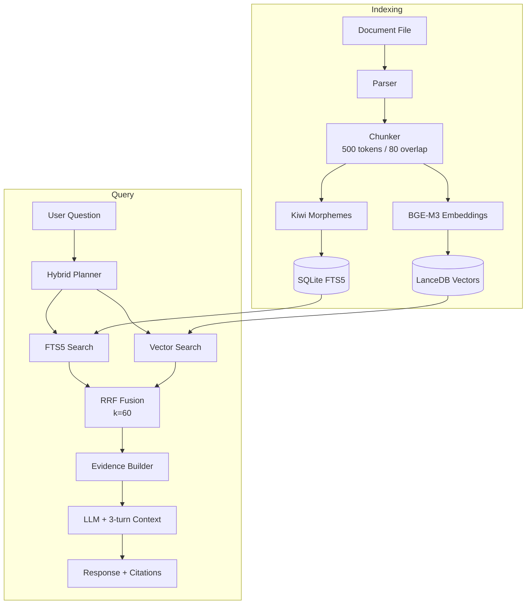

# Architecture Overview

JARVIS follows a **monolith-first** architecture with Protocol-based interfaces, designed for a single Apple Silicon machine. All components communicate in-process through well-defined Python Protocol interfaces.

## System Pipeline

Every user query flows through an 8-step orchestrator pipeline:


### Pipeline Steps

| Step | Component | What it does |
|------|-----------|-------------|
| 1 | **Safety Check** | Regex-based destructive request blocking (`rm -rf`, mass delete) |
| 2 | **Governor** | Check memory, swap, thermal, battery → decide RuntimeTier |
| 3 | **Hybrid Planner** | Heuristic baseline analysis with optional lightweight Korean→English keyword enrichment |
| 4 | **Hybrid Search** | Parallel FTS5 + Vector search → RRF fusion → file-targeted boost |
| 5 | **Evidence Builder** | Assemble citations from search results |
| 6 | **Early Return** | If no evidence found → "cannot answer without sources" |
| 7 | **Safe Mode Check** | If error monitor triggers → search-only response (no generation) |
| 8 | **LLM Generation** | Generate answer with 3-turn conversation context → save + log |

## Module Layers

```
┌──────────────────────────────────────────────┐
│                   CLI / Menu Bar              │  ← User interfaces
│            (repl, menu_bridge, voice)         │
├──────────────────────────────────────────────┤
│                     Core                      │  ← Orchestration
│     (orchestrator, governor, planner, tools)  │
├──────────────────────────────────────────────┤
│    Retrieval    │   Indexing   │   Runtime     │  ← Domain logic
│  (fts, vector,  │ (parsers,    │ (mlx, ollama, │
│   hybrid, rrf)  │  chunker,    │  stt, tts,    │
│                 │  watcher)    │  embeddings)  │
├──────────────────────────────────────────────┤
│               Contracts (Protocols)           │  ← Interfaces (frozen)
│           (13 Protocols, models, states)      │
├──────────────────────────────────────────────┤
│         Memory / Observability / Tools        │  ← Infrastructure
│    (conversation, task_log, metrics, health)  │
└──────────────────────────────────────────────┘
```

## Protocol-First Design

All module boundaries are defined by **13 runtime-checkable Protocol interfaces** (frozen at Day 0):

| Protocol | Purpose |
|----------|---------|
| `QueryDecomposerProtocol` | Break query into typed search fragments |
| `FTSRetrieverProtocol` | Full-text search via SQLite FTS5 |
| `VectorRetrieverProtocol` | ANN search via LanceDB |
| `HybridFusionProtocol` | RRF fusion of FTS + vector results |
| `EvidenceBuilderProtocol` | Build citation evidence from search results |
| `LLMGeneratorProtocol` | Generate answers from evidence |
| `LLMBackendProtocol` | Model load/unload/generate (MLX or Ollama) |
| `EmbeddingRuntimeProtocol` | Text → vector embedding |
| `GovernorProtocol` | Resource monitoring and tier decisions |
| `ConversationStoreProtocol` | Conversation history persistence |
| `TaskLogStoreProtocol` | Audit trail for pipeline stages |
| `ToolRegistryProtocol` | Whitelisted tool execution |
| `ApprovalGatewayProtocol` | User approval gate for writes |

This design enables future extraction of components into separate services without changing consumer code.

## Data Flow: Document → Answer



## Database Schema

SQLite with WAL mode, 5 tables + 1 FTS5 virtual table:

| Table | Purpose | Key Feature |
|-------|---------|-------------|
| `documents` | File metadata | Path, hash, indexing/access status |
| `chunks` | Document segments | Text, morphemes, heading path, embedding reference |
| `chunks_fts` | Full-text index | FTS5 virtual table over text + morphemes |
| `citations` | Evidence tracking | State: VALID / STALE / MISSING / ACCESS_LOST |
| `conversation_turns` | Chat history | 3-turn sliding window for LLM context |
| `task_logs` | Audit trail | Per-stage timing, status, error codes |

Three triggers keep `chunks_fts` synchronized with `chunks` on insert/delete/update.

## Directory Structure

```
alliance_20260317_130542/
├── src/jarvis/
│   ├── __main__.py              # Entry point
│   ├── app/                     # Bootstrap, config, runtime context
│   ├── cli/                     # REPL, menu bridge, voice session
│   ├── contracts/               # 13 Protocols, models, states, errors
│   ├── core/                    # Orchestrator, governor, planner, tools
│   ├── indexing/                # Parsers, chunker, file watcher
│   ├── retrieval/               # FTS, vector, hybrid, evidence
│   ├── runtime/                 # MLX, Ollama, STT, TTS, embeddings
│   ├── memory/                  # Conversation store, task log
│   ├── tools/                   # read_file, search_files, draft_export
│   ├── observability/           # Metrics, health, logging, tracing
│   └── perf/                    # Benchmark harness
├── macos/JarvisMenuBar/         # SwiftUI menu bar app
├── sql/schema.sql               # Database schema
├── tests/                       # 335 tests
└── docs/                        # Design specs
```

## Key Design Principles

1. **Retrieval-first** — Search quality before generation quality
2. **Citation-required** — No factual answer without source evidence
3. **Measurement-driven** — 11 metrics tracked (latency, TTFT, retrieval quality, etc.)
4. **Graceful degradation** — Governor tiers, error monitor, parser fallbacks
5. **Minimal privilege** — Only 3 tools, approval-gated writes

## Related Pages

- [[Tech Stack]] — Why each technology was chosen
- [[Retrieval Pipeline]] — Deep dive into FTS5 + Vector + RRF
- [[Security Model]] — Safety levels and approval gates
- [[Design Decisions]] — Engineering judgment behind the architecture

---

## :kr: 한국어

# 아키텍처 개요

JARVIS는 **모놀리스 우선** 아키텍처에 Protocol 기반 인터페이스를 적용하여, 단일 Apple Silicon 머신에서 동작하도록 설계되었습니다.

### 시스템 파이프라인

모든 사용자 쿼리는 8단계 오케스트레이터 파이프라인을 거칩니다:

1. **안전 검사** — 파괴적 요청 차단 (rm -rf, 전체 삭제 등)
2. **거버너** — 메모리, 스왑, 발열, 배터리 확인 → 런타임 티어 결정
3. **하이브리드 플래너** — 휴리스틱 baseline 분석 + 조건부 한→영 키워드 보강
4. **하이브리드 검색** — FTS5 + 벡터 병렬 검색 → RRF 융합
5. **증거 빌더** — 검색 결과에서 인용 증거 조립
6. **증거 없음 조기 반환** — 증거 없으면 "근거 없이 생성 불가"
7. **안전 모드 확인** — 오류 모니터 트리거 시 검색 결과만 반환
8. **LLM 생성** — 3턴 대화 컨텍스트와 함께 답변 생성 → 저장

### Protocol 우선 설계

모든 모듈 경계가 **13개의 runtime-checkable Protocol 인터페이스**로 정의됩니다 (Day 0에 확정). 이 설계를 통해 향후 컴포넌트를 별도 서비스로 분리할 때 소비자 코드 변경이 필요 없습니다.

### 데이터 흐름

```
문서 파일 → 파서 → 청커(500토큰/80오버랩) → FTS5 인덱스 + LanceDB 벡터
사용자 질문 → AI 플래너 → FTS5 검색 + 벡터 검색 → RRF 융합 → 증거 → LLM → 답변 + 출처
```

### 핵심 설계 원칙

1. **검색 우선** — 생성 품질보다 검색 품질이 먼저
2. **출처 필수** — 증거 없이 사실 답변 금지
3. **측정 기반** — 11개 지표 추적
4. **점진적 성능 저하** — 거버너 티어, 오류 모니터, 파서 폴백
5. **최소 권한** — 도구 3개만, 쓰기는 승인 필요
