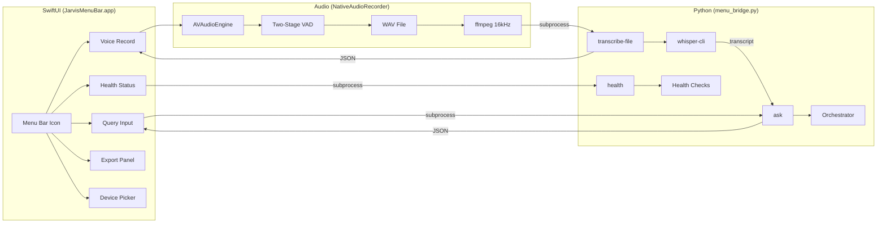
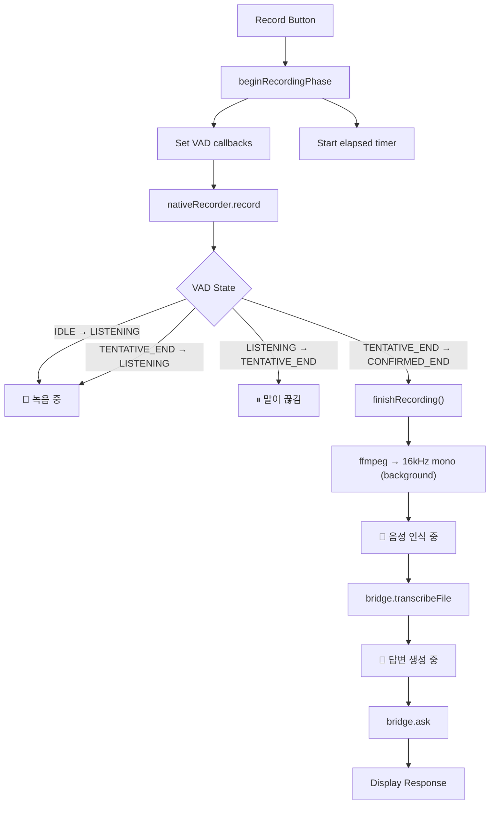

# Menu Bar App

JARVIS includes a native macOS menu bar application built with SwiftUI that provides quick access to queries, voice interaction, and system health — all without opening a terminal.

## Architecture



### Bridge Commands

| Command | Input | Output | Description |
|---------|-------|--------|-------------|
| `ask` | `--query` | MenuResponse | Text query → search + LLM answer |
| `transcribe-file` | `--audio` | TranscriptionResponse | WAV file → whisper-cli → transcript |
| `transcribe-once` | `--device` | TranscriptionResponse | Record + transcribe (legacy ffmpeg) |
| `record-once` | `--device` | MenuResponse | Record + transcribe + answer (legacy) |
| `export-draft` | `--content`, `--destination` | ExportResponse | Approval-gated file export |
| `health` | — | HealthResponse | System health check |

### One-Shot Subprocess Model

The menu bar app communicates with Python through **one-shot subprocess calls** — each interaction spawns a new Python process, sends input, and reads JSON output.

- **No connection management** — no sockets, no reconnection logic
- **Clean state** — each request starts fresh
- **Crash isolation** — a Python crash doesn't take down the menu bar

## Voice Recording Flow



## UI Phases

| Phase | Color | Status Text |
|-------|-------|-------------|
| idle | Gray | 대기 중 |
| recording | 🔴 Red | 녹음 중 (elapsed) |
| pauseDetected | 🟡 Yellow | 말이 끊김 — 이어서 말하면 계속 녹음합니다 |
| transcribing | 🟠 Orange | 음성을 텍스트로 변환 중 |
| answering | 🔵 Blue | 검색 및 답변 생성 중 |
| cooldown | 🟢 Mint | 다음 입력 준비 중 |
| error | 🔴 Red | 오류 발생 |

## Features

### Text Query
Type a question in the menu bar → Python processes through the full orchestrator pipeline → response with citations displayed inline.

### Voice Interaction
- **PTT Once**: Click mic button → VAD-driven recording → auto-stop on silence → transcribe → answer
- **Live Loop**: Continuous voice conversation — each cycle records, transcribes, answers, then loops

### Response Display
- Responses truncated at 500 characters in UI with "...more" button
- Full response saved to `/tmp/jarvis_responses/` temp file
- "...more" button opens full response in system text editor

### Export Panel
- Inline overlay panel (not .sheet — prevents MenuBarExtra dismiss)
- Format selection: TXT / MD
- Location: ~/.jarvis/exports, Desktop, Documents
- Full response content exported (not truncated display text)

### Health Status
Real-time system health display:
- 11 health checks (4 core + 5 runtime + 2 bridge-layer)
- Memory, swap, thermal, battery status
- Chunk count, vector index status
- Governor mode indicator

### Input Device Selection
- Device list populated via CoreAudio API (not AVCaptureDevice — avoids aggregate device hang)
- Device change triggers engine reconfiguration on next recording
- Unicode NFC/NFD normalization for Korean device names

## Build & Run

### Terminal (recommended for development)

```bash
cd macos/JarvisMenuBar

# Build with entitlements (required for microphone access)
make build

# Run
.build/JarvisMenuBar.app/Contents/MacOS/JarvisMenuBar &
```

### Xcode

1. Open `JarvisMenuBar.xcodeproj`
2. Signing is auto-configured (Team: JX58296577)
3. ⌘R to build and run
4. ⌘⇧K to clean build folder

### Requirements
- macOS 14.0+ (Sonoma)
- Swift 6.0+
- Xcode 16+ (for .xcodeproj)
- `com.apple.security.device.audio-input` entitlement
- Python JARVIS installed (menu bar calls `python -m jarvis`)
- ffmpeg installed (`/opt/homebrew/bin/ffmpeg`)

### Important Build Notes
- **`make build`** includes entitlements via `codesign --entitlements`
- **`swift build` alone** does NOT include entitlements → microphone access silently fails
- **Xcode build** automatically includes entitlements from project settings

## Quit

- **Button**: "Quit JARVIS ⌘Q" at bottom of panel
- **Keyboard**: ⌘Q

## Related Pages

- [[Voice Pipeline]] — Voice mode details and VAD documentation
- [[Architecture Overview]] — How the menu bar fits in the system
- [[Security Model]] — Approval gate for writes, TCC permissions

---

## :kr: 한국어

# 메뉴바 앱

JARVIS는 SwiftUI로 만든 네이티브 macOS 메뉴바 앱을 포함합니다. 터미널 없이 쿼리, 음성, 시스템 상태에 빠르게 접근할 수 있습니다.

### 아키텍처

메뉴바 앱은 Python과 **원샷 서브프로세스 호출**로 통신합니다. 녹음은 AVAudioEngine(Swift 네이티브)으로 처리하고, STT/LLM은 Python 서브프로세스로 처리합니다.

### 녹음 흐름

1. 녹음 버튼 클릭 → AVAudioEngine tap 활성화
2. Two-Stage VAD로 음성/무음 자동 감지
3. 3초 무음 → 녹음 자동 종료
4. ffmpeg로 16kHz mono 변환 → whisper-cli STT
5. 검색 + LLM 답변 생성 → 결과 표시

### 빌드 방법

```bash
cd macos/JarvisMenuBar
make build  # entitlements 포함 빌드 (필수)
```

또는 Xcode에서 `JarvisMenuBar.xcodeproj` 열고 ⌘R.

**중요**: `swift build` 단독 사용 시 entitlements가 포함되지 않아 마이크 접근이 안 됩니다. 반드시 `make build` 사용.
