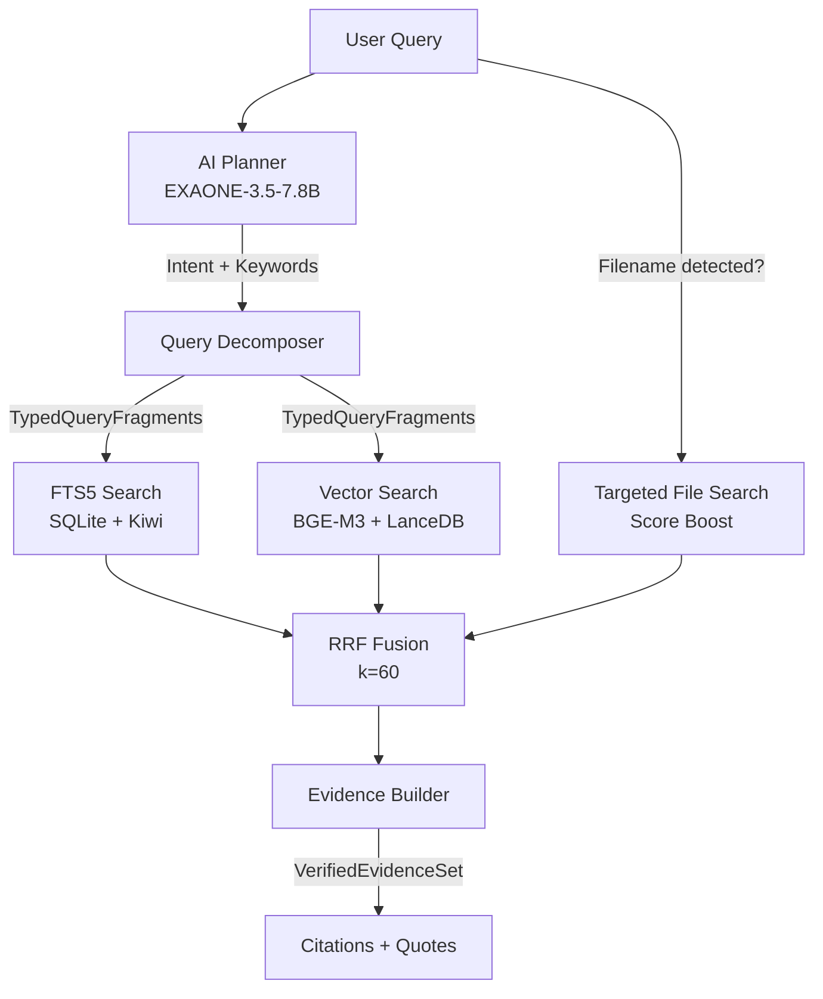

# Retrieval Pipeline

JARVIS uses a **hybrid retrieval architecture** that combines full-text search with vector similarity search, fused via Reciprocal Rank Fusion (RRF). This approach overcomes the limitations of either method alone — FTS excels at exact keyword matching while vectors capture semantic similarity.

## Architecture



## 1. AI Planner

Before any search happens, the **AI Planner** (powered by EXAONE-3.5-7.8B) classifies the query:

- **Intent classification**: What kind of question is this?
- **Korean → English keyword translation**: Extract search terms in both languages
- **Search term extraction**: Identify the most relevant terms for retrieval

This lightweight model runs fast (~2-3s) and doesn't compete with the main LLM for memory.

## 2. FTS5 Full-Text Search

**Technology**: SQLite FTS5 + Kiwi morphological tokenizer

### How it works

1. **Indexing**: Document chunks are tokenized by Kiwi into Korean morphemes, stored in `chunks_fts` virtual table
2. **Query**: User query is also tokenized by Kiwi, then matched against the FTS5 index
3. **Scoring**: BM25 ranking with morpheme-aware matching

### Korean-specific advantages

Kiwi decomposes Korean text into morphemes, enabling accurate search:

```
"인공지능 기술이 발전하고 있습니다"
→ morphemes: ["인공지능", "기술", "이", "발전", "하", "고", "있", "습니다"]
→ search-relevant: ["인공지능", "기술", "발전"]
```

Without morphological analysis, searching for "기술" wouldn't match "기술이" or "기술의" — Kiwi solves this.

### Schema

```sql
CREATE VIRTUAL TABLE chunks_fts USING fts5(
    text,
    lexical_morphs,
    content='chunks',
    content_rowid='rowid'
);
```

## 3. Vector Search

**Technology**: BGE-M3 embeddings + LanceDB ANN + MPS acceleration

### How it works

1. **Indexing**: Document chunks → BGE-M3 → dense vectors → stored in LanceDB
2. **Query**: User query → BGE-M3 → query vector → ANN search in LanceDB
3. **Scoring**: Cosine similarity

### Why BGE-M3?

- **Multilingual**: Strong performance on both Korean and English
- **MPS accelerated**: Uses Apple's Metal Performance Shaders via sentence-transformers
- **Note**: BGE-M3 cannot run on MLX (discovered during implementation) — we use sentence-transformers + MPS instead

### Embedding Backfill

Vector indexing runs as a **background daemon** to avoid blocking the main pipeline:

```
Document added → FTS5 indexed immediately (synchronous)
                → Vector embedding queued (asynchronous backfill)
```

## 4. RRF Fusion

**Reciprocal Rank Fusion** combines FTS5 and vector search results into a single ranked list.

### Formula

For each document `d` across all ranking methods:

```
RRF_score(d) = Σ  1 / (k + rank_i(d))
```

Where `k = 60` (default) and `rank_i(d)` is the rank of document `d` in the i-th ranking.

### Why RRF?

- **No score normalization needed** — works with ranks, not raw scores
- **Robust** — naturally handles cases where a document appears in only one ranking
- **Tunable** — the `k` parameter controls how much to favor top-ranked results

### Targeted File Search

When the query mentions a specific filename (e.g., "보고서.pdf의 결론"), JARVIS applies a **score boost** to chunks from that file, ensuring relevant file-specific results bubble up.

## 5. Evidence Builder

After RRF fusion, the Evidence Builder:

1. Selects the top-k chunks (governed by RuntimeTier: 4/8/10 chunks)
2. Extracts quoted text from each chunk
3. Resolves source file metadata (filename, type, path)
4. Checks citation freshness (SHA-256 hash comparison)
5. Produces a `VerifiedEvidenceSet` with citations

### Citation States

| State | Meaning | User Impact |
|-------|---------|-------------|
| `VALID` | Source file unchanged since indexing | Full confidence |
| `STALE` | Source file modified since indexing | Warning shown |
| `REINDEXING` | Currently being re-indexed | Temporary |
| `MISSING` | Source file deleted | Warning shown |
| `ACCESS_LOST` | Permission denied to source | Warning shown |

## 6. Freshness Detection

JARVIS uses **SHA-256 content hashing** to detect when indexed documents become stale:

- Each document's hash is stored at index time
- On query, the current file hash is compared
- If different → citation state changes to `STALE`
- Time-based freshness boost: recently modified documents get a small score increase

## Indexing Pipeline

### Document → Chunks

```
File detected (watchdog/FSEvents)
  → Parser (PyMuPDF/python-docx/openpyxl/...)
  → Chunker (500 tokens / 80 overlap / heading-aware)
  → Kiwi morpheme extraction
  → FTS5 insert (immediate)
  → BGE-M3 embedding (background backfill)
```

### Chunking Strategy

| Parameter | Value | Rationale |
|-----------|-------|-----------|
| Chunk size | 500 tokens | Balance between context and precision |
| Overlap | 80 tokens | Prevent information loss at boundaries |
| Heading-aware | Yes | Preserve document structure in chunks |
| UTF-8 boundary safe | Yes | Never split mid-character |

### Supported Formats

80+ file extensions including:
- **Documents**: PDF, DOCX, PPTX, XLSX, HWP, HWPX
- **Text**: MD, TXT, CSV, TSV
- **Code**: PY, JS, TS, Java, Go, Rust, C, C++, ...
- **Data**: JSON, YAML, XML, TOML
- **Encodings**: UTF-8, CP949, UTF-16 LE

### Real-time File Watching

- **watchdog** with macOS FSEvents backend
- Handles: file create, modify, delete, move
- Tombstone cleanup for deleted files
- Governor-controlled: pauses on thermal/battery pressure

## Related Pages

- [[Architecture Overview]] — How retrieval fits in the pipeline
- [[Tech Stack]] — Why FTS5 + LanceDB + BGE-M3
- [[Configuration]] — Tuning search parameters

---

## :kr: 한국어

# 검색 파이프라인

JARVIS는 전문 검색(FTS)과 벡터 유사도 검색을 결합한 **하이브리드 검색 아키텍처**를 사용합니다. Reciprocal Rank Fusion(RRF)으로 두 결과를 융합합니다.

### 왜 하이브리드인가?

- **FTS5**: 정확한 키워드 매칭에 강함 (예: "Qwen3" 검색 시 정확히 매칭)
- **벡터 검색**: 의미적 유사성에 강함 (예: "AI 모델"로 "인공지능 엔진" 매칭)
- **RRF 융합**: 두 방법의 장점을 결합, 단일 방법보다 높은 검색 품질

### 한국어 특화

Kiwi 형태소 분석기가 한국어 텍스트를 형태소로 분해하여 정확한 검색을 가능하게 합니다:

```
"인공지능 기술이 발전하고 있습니다"
→ 형태소: ["인공지능", "기술", "발전"]
```

형태소 분석 없이는 "기술"로 "기술이"나 "기술의"를 찾을 수 없습니다.

### 인덱싱 파이프라인

```
파일 감지 → 파서 → 청커(500토큰/80오버랩) → Kiwi 형태소 → FTS5 즉시 삽입 + 벡터 백필(비동기)
```

### 인용 상태

| 상태 | 의미 |
|------|------|
| `VALID` | 인덱싱 이후 원본 변경 없음 |
| `STALE` | 원본 파일 수정됨 (경고 표시) |
| `MISSING` | 원본 파일 삭제됨 (경고 표시) |
| `ACCESS_LOST` | 접근 권한 없음 (경고 표시) |
