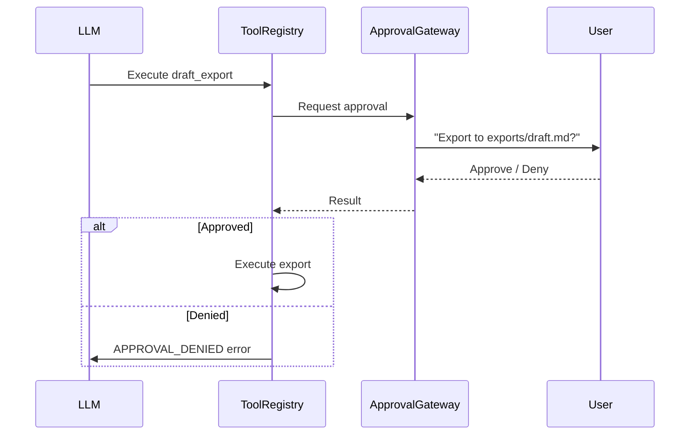

# Security Model

JARVIS implements a **5-level safety architecture** that deliberately limits what the system can do. Levels 3 and 4 are intentionally excluded — JARVIS is designed as a workspace assistant, not an autonomous agent.

## Safety Levels

```
Level 0  ████████████████████████  Text-only (no KB access)
Level 1  ████████████████████████  Selective folder read
Level 2  ████████████████████████  Approval-gated write
Level 3  ░░░░░░░░░░░░░░░░░░░░░░  Auto-execution — EXCLUDED
Level 4  ░░░░░░░░░░░░░░░░░░░░░░  Full autonomy — EXCLUDED
```

### Level 0: Text-only Conversation

- No knowledge base access
- Pure LLM conversation
- No file reading, no search
- Active when: no watched folders configured

### Level 1: Selective Folder Read

- Read access to `knowledge_base/` directory only
- No access to files outside configured folders
- Tools available: `read_file`, `search_files`
- Active when: watched folders configured, normal operation

### Level 2: Approval-Gated Write

- Everything in Level 1 plus `draft_export` tool
- **Every write requires explicit user approval**
- Export goes to `~/.jarvis/exports/` only
- Active when: user invokes draft export

### Level 3 & 4: Excluded by Design

Unrestricted command execution and full autonomy are **intentionally out of scope**:

> "JARVIS is a workspace assistant, not an autonomous agent. The decision to exclude Levels 3-4 is a conscious design choice, not a limitation."
> — DECISIONS.md

## Tool Whitelist

Only 3 tools are registered in the system:

| Tool | Level | Permission | Description |
|------|-------|-----------|-------------|
| `read_file` | 1 | Read | Read a file from watched folders |
| `search_files` | 1 | Read | Search the knowledge base |
| `draft_export` | 2 | Write (approval required) | Export a draft to the exports directory |

The `ToolRegistry` enforces this whitelist — unregistered tools cannot be executed.

## Approval Gate Flow



## Destructive Request Blocking

The orchestrator's **first pipeline step** blocks destructive requests via regex patterns:

| Category | Patterns Blocked |
|----------|-----------------|
| File deletion | `rm -rf`, `rm -r`, recursive delete |
| Disk operations | `format`, `wipe`, `erase` |
| Korean patterns | "모든 파일 삭제", "전체 폴더 삭제" |

These are hard-blocked before any processing occurs.

## Governor Safety Controls

The Resource Governor protects the system from resource exhaustion:

### Threshold Rules (Priority Order)

| Condition | Action | Governor Mode |
|-----------|--------|--------------|
| Swap ≥ 4,096 MB | Force `unloaded` tier | SHUTDOWN |
| Thermal = `critical` | Force `unloaded` tier | SHUTDOWN |
| Swap ≥ 2,048 MB | Force `fast` tier | DEGRADED |
| Thermal = `serious` | Force `fast` tier | DEGRADED |
| Memory ≥ 70% | Downgrade from balanced/deep | DEGRADED |
| Memory ≥ 60% | Downgrade from deep | RESTRICTED |
| Battery < 30% (deep tier only) | Downgrade deep → balanced | (tier change only) |

### Resource Budget Gate

| Condition | Result |
|-----------|--------|
| Memory ≥ 90% | **Block** — refuse to start generation |
| Swap ≥ 4,096 MB | **Block** — refuse to start generation |

### Indexing Controls

| Condition | Action |
|-----------|--------|
| Thermal = serious/critical | **Pause** indexing |
| Battery < 30% (on battery) | **Pause** indexing |
| Thermal = fair | Backoff indexing rate |
| Index queue ≥ 8 | Backoff indexing rate |

### TTFT Feedback Loop

If the last Time-to-First-Token (TTFT) exceeds 4,000ms:
- Reduce max chunks by 2
- Halve context window size
- This prevents the system from overwhelming a resource-constrained machine

## Error Monitor

The `ErrorMonitor` tracks consecutive failures and can trigger protective modes:

- **Degraded mode**: After repeated retrieval failures → limits search scope
- **Safe mode**: After repeated generation failures → search-only responses (no LLM generation)
- **Generation blocked**: After critical failures → only shows top-3 evidence snippets

## macOS TCC Permissions

| Permission | When Required | How to Grant |
|------------|--------------|-------------|
| Microphone | Voice modes (PTT, live loop) | System Settings → Privacy → Microphone |
| Files & Folders | Accessing knowledge_base/ | Automatic for user-owned directories |

JARVIS performs a **TCC permission preflight check** before attempting to record audio. If the permission is not granted, a clear error message is displayed.

## SQLite Security

- **WAL mode**: Write-Ahead Logging for concurrent read safety
- **Foreign keys enforced**: Data integrity across tables
- **Integrity check**: On startup, validates database consistency
- **Read-only fallback**: If integrity check fails, enters read-only mode with rebuild recommendation

## Related Pages

- [[Architecture Overview]] — How safety integrates into the pipeline
- [[Design Decisions]] — Why Levels 3-4 were excluded
- [[Voice Pipeline]] — Microphone permission details

---

## :kr: 한국어

# 보안 모델

JARVIS는 시스템이 할 수 있는 것을 의도적으로 제한하는 **5단계 안전 아키텍처**를 구현합니다.

### 안전 레벨

| 레벨 | 상태 | 설명 |
|------|------|------|
| 0 | 활성 | 텍스트 전용 (KB 접근 없음) |
| 1 | 활성 | 선택적 폴더 읽기 (`knowledge_base/`만) |
| 2 | 활성 | 승인 기반 쓰기 (`draft_export`) |
| 3 | **제외** | 자동 실행 — 의도적으로 범위 밖 |
| 4 | **제외** | 완전 자율 — 의도적으로 범위 밖 |

### 도구 화이트리스트

| 도구 | 권한 | 설명 |
|------|------|------|
| `read_file` | 읽기 | 감시 폴더의 파일 읽기 |
| `search_files` | 읽기 | 지식 베이스 검색 |
| `draft_export` | 쓰기 (승인 필요) | 초안을 exports 디렉토리로 내보내기 |

### 거버너 안전 제어

| 조건 | 동작 |
|------|------|
| 스왑 ≥ 4,096 MB | 생성 차단 (SHUTDOWN) |
| 발열 = critical | 생성 차단 (SHUTDOWN) |
| 메모리 ≥ 90% | 생성 차단 |
| 메모리 ≥ 70% | 티어 하향 (DEGRADED) |
| 배터리 < 30% | 티어 하향 |

### 파괴적 요청 차단

오케스트레이터 첫 단계에서 `rm -rf`, 디스크 포맷, "모든 파일 삭제" 등 파괴적 요청을 정규식으로 차단합니다.

### macOS TCC 권한

| 권한 | 필요 시점 |
|------|----------|
| 마이크 | 음성 모드 (PTT, 라이브 루프) |
| 파일 접근 | knowledge_base/ 접근 |

마이크 녹음 시도 전에 TCC 권한 사전 점검을 수행합니다.
