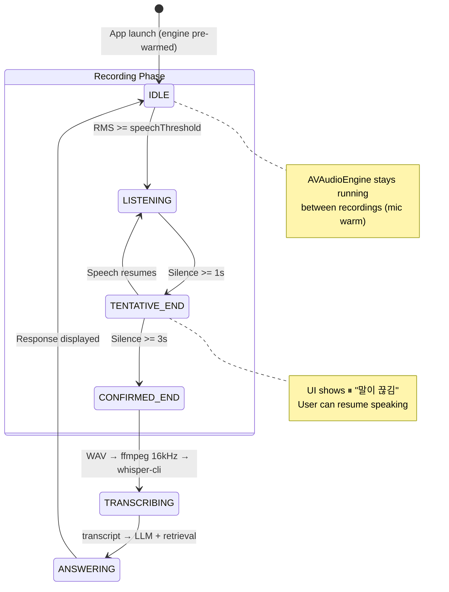
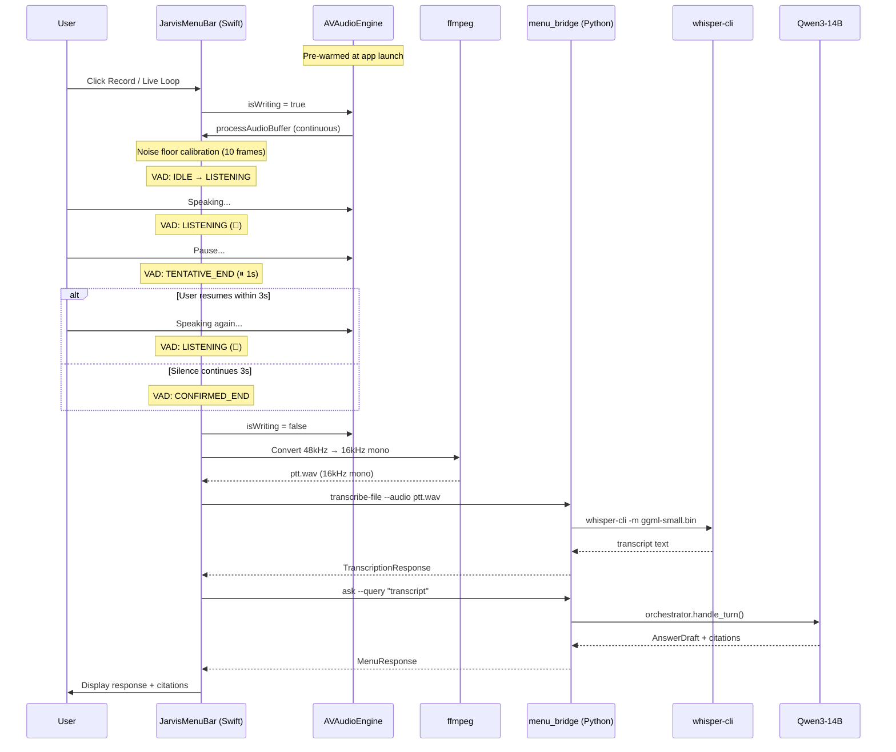
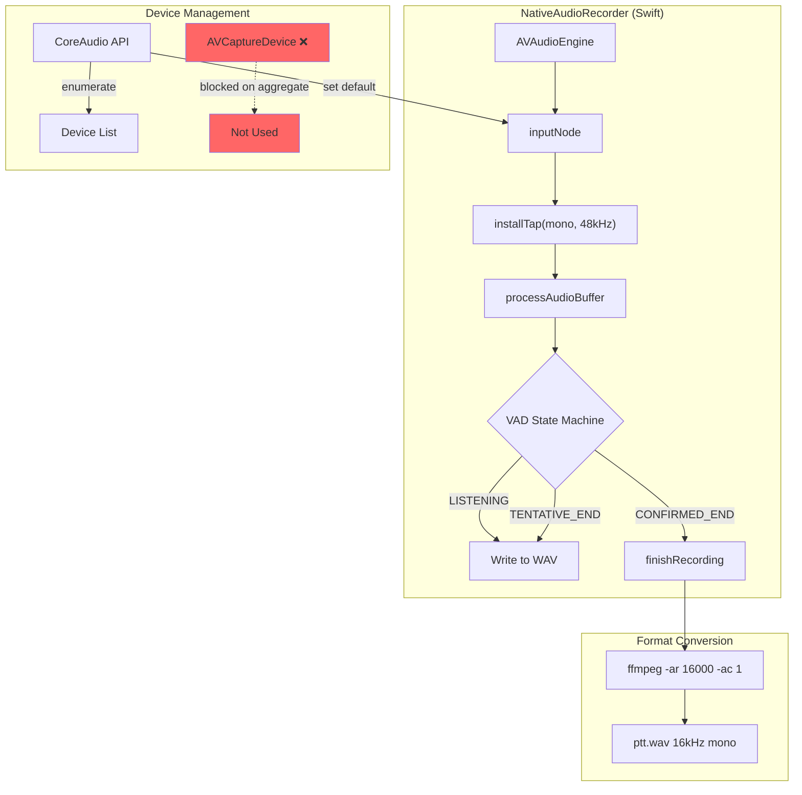

# Voice Pipeline

JARVIS provides fully local voice interaction — speech-to-text, LLM processing, and text-to-speech — all running on Apple Silicon without cloud APIs.

## Recording Process (AVAudioEngine + Two-Stage VAD)



## End-to-End Voice Flow



## Audio Engine Architecture



## Two-Stage VAD (Voice Activity Detection)

### Adaptive Noise Floor Calibration

First 10 audio frames measure the ambient noise level, then thresholds are computed:

| Parameter | Formula | Example (noise=0.04) |
|-----------|---------|---------------------|
| silenceThreshold | max(0.005, noise × 1.3) | 0.052 |
| speechThreshold | max(0.01, noise × 2.0) | 0.080 |

### State Machine

| State | Condition | Next State | UI |
|-------|-----------|------------|-----|
| **IDLE** | RMS >= speechThreshold | LISTENING | 🔴 녹음 중 |
| **LISTENING** | Silence >= 1s | TENTATIVE_END | ⏸ 말이 끊김 |
| **TENTATIVE_END** | Speech resumes | LISTENING | 🔴 녹음 중 |
| **TENTATIVE_END** | Silence >= 3s total | CONFIRMED_END | 🔄 음성 인식 |
| **CONFIRMED_END** | — | finishRecording() | 💬 답변 생성 |

### Timing Parameters

| Parameter | Value | Purpose |
|-----------|-------|---------|
| Calibration frames | 10 | ~0.5s noise floor measurement |
| Tentative silence | 1.0s | Short pause detection |
| Confirmed silence | 3.0s | End-of-utterance confirmation |
| Min recording | 2.0s | Prevent premature cutoff |
| Max recording | 30s | Safety cap |

## Three Voice Modes

| Mode | CLI Flag | Behavior | Use Case |
|------|----------|----------|----------|
| **File** | `--voice-file=<path>` | Process a pre-recorded audio file | Batch processing, testing |
| **PTT Once** | Record button | Record → VAD auto-stop → transcribe → answer | Quick single question |
| **Live Loop** | Live Loop toggle | Continuous VAD-driven conversation | Hands-free assistant |

## Components

### Audio Recording: AVAudioEngine (Swift)

| Property | Value |
|----------|-------|
| Engine | AVAudioEngine with installTap |
| Format | Mono interleaved float32 at native sample rate |
| VAD | Two-stage energy-based (adaptive thresholds) |
| Post-processing | ffmpeg 16kHz mono conversion |
| Device Selection | CoreAudio API (not AVCaptureDevice) |
| Entitlement | `com.apple.security.device.audio-input` |

### STT: whisper.cpp

| Property | Value |
|----------|-------|
| Engine | whisper.cpp (whisper-cli) |
| Acceleration | Metal (Apple Silicon native) |
| Model | Configurable via `JARVIS_STT_MODEL` |
| Input | WAV 16kHz mono (via ffmpeg conversion) |
| Output | Transcribed text |
| Hallucination filter | Kiwi morpheme pattern + substring detection |

### TTS: Qwen3-TTS

| Property | Value |
|----------|-------|
| Engine | Qwen3-TTS |
| Voice | Configurable via `JARVIS_TTS_VOICE` (default: "Sora") |
| Language | Korean + English |
| Output | WAV audio |

## Device Compatibility

| Device | Channels | Status | Notes |
|--------|----------|--------|-------|
| MacBook Pro 마이크 | Mono | ✅ | Built-in, works with Voice Processing |
| Revelator (USB) | Stereo | ✅ | Direct mic, best quality |
| Revelator Stream Mix A/B | Stereo | ✅ | Virtual mix output |
| Revelator통합 (Aggregate) | 6ch | ⚠️ | Aggregate device, may cause AUHAL errors |
| iPhone 마이크 | Mono | ✅ | Continuity mic |
| BlackHole/BoomAudio | Virtual | ❌ | No physical mic input |

### Known Device Issues

- **AVCaptureDevice API**: Hangs on aggregate devices (6ch). Replaced with CoreAudio `AudioObjectGetPropertyData`.
- **Voice Processing**: Causes AUHAL format errors on aggregate/multi-channel devices. Disabled for now.
- **Unicode NFC/NFD**: Korean device names need normalization for reliable matching.

## Memory Management

Voice models follow the **sequential loading strategy**:

```
[Record Audio via AVAudioEngine]
    ↓
[whisper-cli] → Transcribe → [process exits]
    ↓
[Query through Orchestrator pipeline - LLM loaded/unloaded here]
    ↓
[Qwen3-TTS] → Synthesize → [process exits]
    ↓
[Play Audio]
```

## Configuration

| Setting | Environment Variable | Default |
|---------|---------------------|---------|
| STT model | `JARVIS_STT_MODEL` | Built-in whisper model |
| TTS voice | `JARVIS_TTS_VOICE` | `Sora` |
| Recording duration (max) | `JARVIS_PTT_SECONDS` | `8` seconds (VAD may stop earlier) |
| Mic device | UI device picker | System default |

## Build Requirements

| Requirement | Details |
|-------------|---------|
| Build command | `make build` (includes entitlements) |
| Entitlement | `com.apple.security.device.audio-input` |
| Xcode project | `JarvisMenuBar.xcodeproj` |
| macOS | 14.0+ (Sonoma) |
| Swift | 6.0+ |

## Related Pages

- [[Menu Bar App]] — Voice integration in the SwiftUI menu bar
- [[Security Model]] — Microphone TCC permissions
- [[Getting Started]] — Quick start with voice modes

---

## :kr: 한국어

# 음성 파이프라인

JARVIS는 완전 로컬 음성 인터랙션을 제공합니다 — STT, LLM 처리, TTS 모두 Apple Silicon에서 실행됩니다.

### 녹음 프로세스

AVAudioEngine 기반 네이티브 녹음 + Two-Stage VAD:

```
앱 시작 → 엔진 사전 웜업 (마이크 항상 warm)
    ↓
녹음 버튼 클릭 → isWriting = true → 즉시 수음 시작
    ↓
노이즈 플로어 캘리브레이션 (10프레임, ~0.5초)
    ↓
VAD 상태 머신:
  IDLE → LISTENING (음성 감지)
  LISTENING → TENTATIVE_END (1초 무음)
  TENTATIVE_END → LISTENING (다시 말하면 복귀)
  TENTATIVE_END → CONFIRMED_END (3초 무음 → 녹음 종료)
    ↓
ffmpeg 48kHz → 16kHz mono 변환 (백그라운드)
    ↓
whisper-cli STT 변환
    ↓
Orchestrator 검색 + LLM 답변 생성
    ↓
결과 표시
```

### 장치 호환성

- MacBook Pro 마이크: ✅ 완전 지원
- Revelator (USB 다이렉트): ✅ 권장
- Revelator Stream Mix A/B: ✅ 지원
- Revelator통합 (6ch aggregate): ⚠️ AUHAL 오류 가능
- 가상 장치 (BlackHole 등): ❌ 물리 마이크 없음

### 알려진 제한

- Voice Processing (노이즈 억제)은 aggregate 장치에서 비활성화
- VAD는 에너지 기반 — ML 기반 Silero VAD는 Phase 2로 유보
- 스트리밍 STT는 미지원 (파일 기반 whisper-cli)
